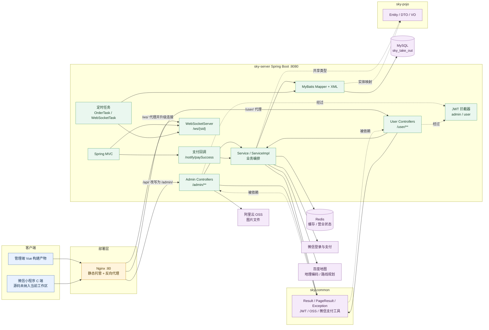
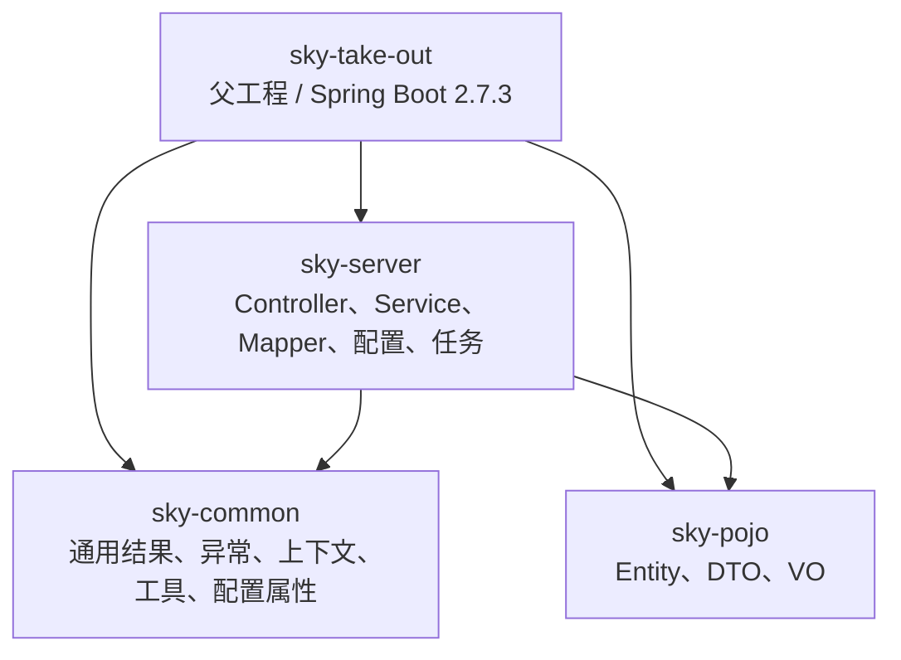
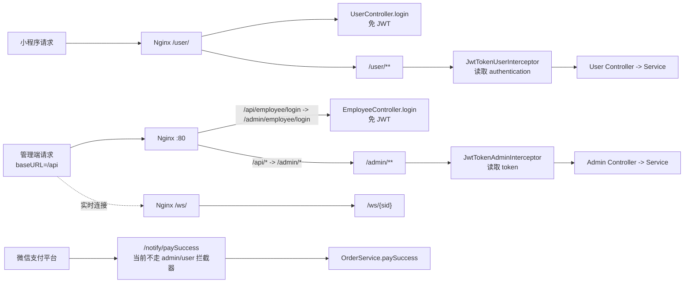
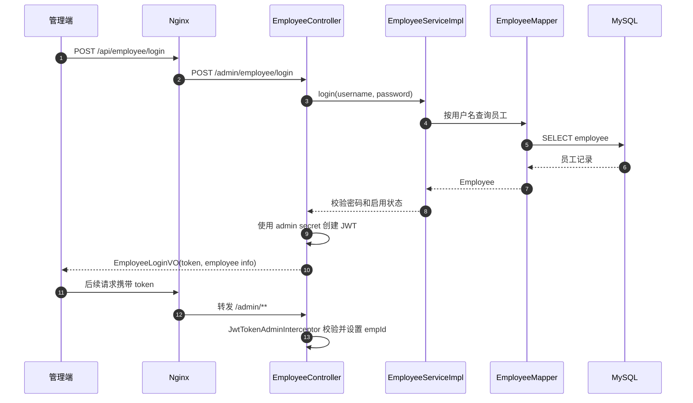
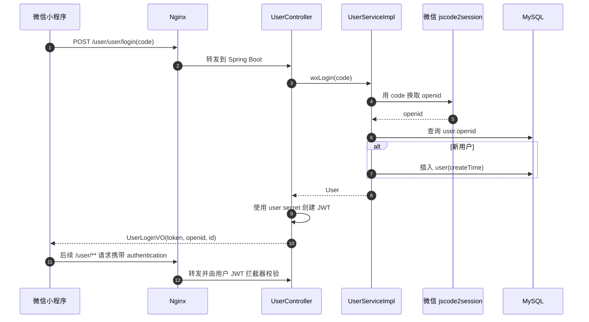
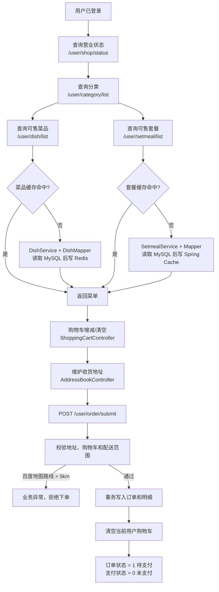
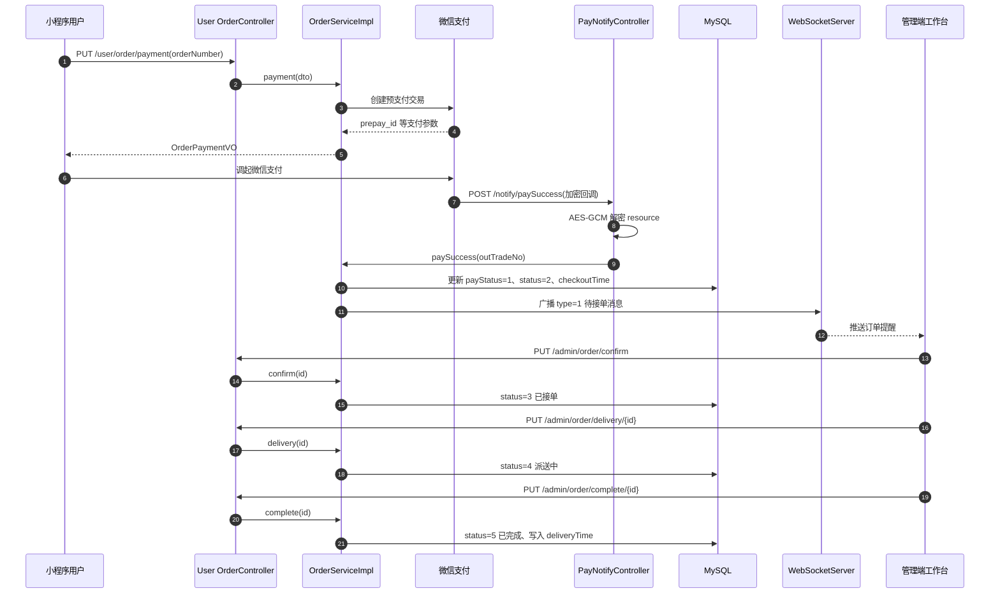
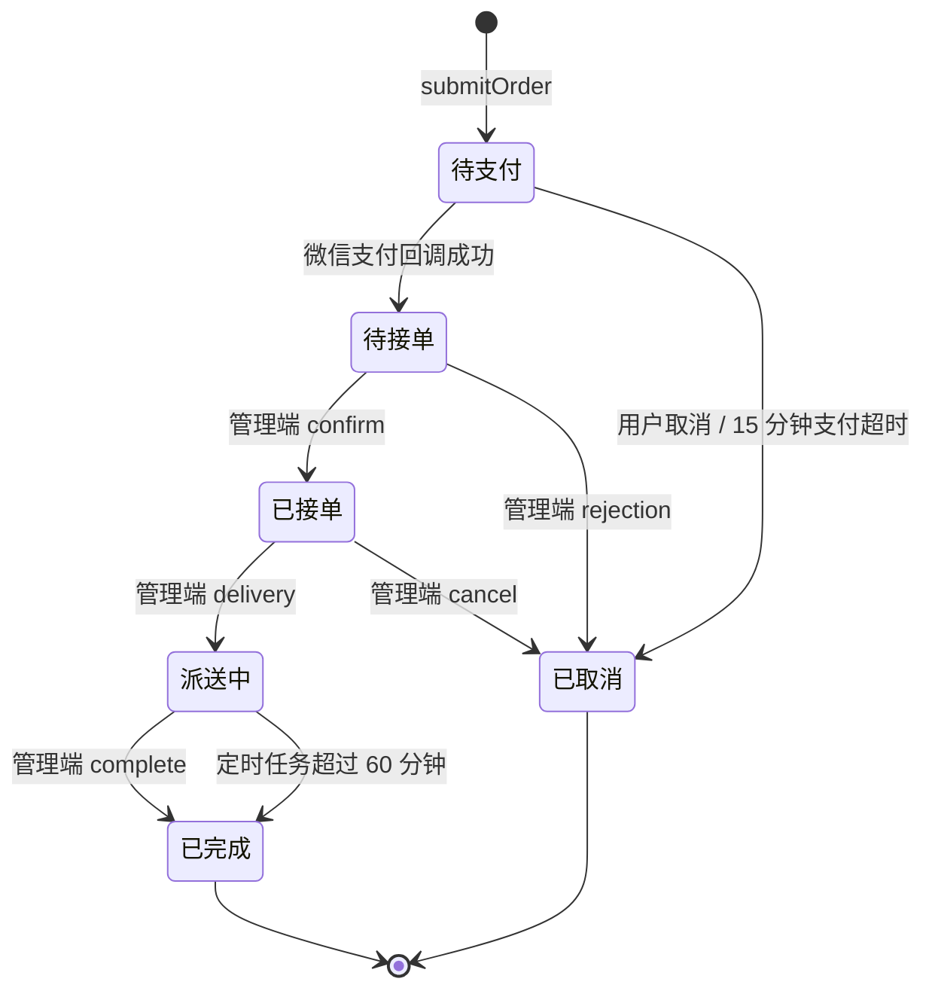
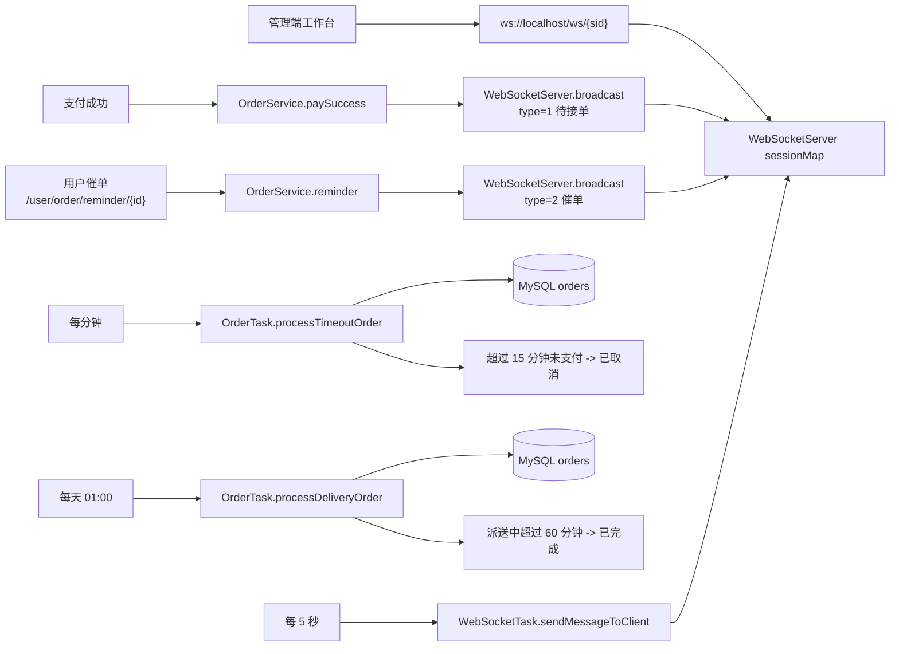
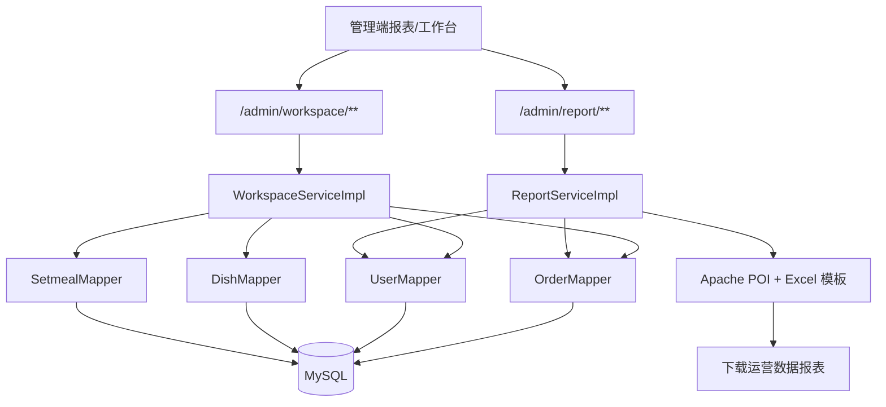

# 苍穹外卖项目 Walkthrough

> 本文基于当前工作区的源码、Nginx 配置、Maven 配置和已构建的管理端静态资源整理。
> 生成时间：2026-08-07

## 1. 项目边界

当前工作区由两部分组成：

- `sky-take-out`：Spring Boot 后端源码，采用 Maven 多模块结构。
- `qianduan/nginx-1.20.2`：Nginx 运行目录及已构建的 Vue 管理端资源，入口为 `html/sky`。
- 根目录的 `project.config.json` 表明项目还对应一个微信小程序，但当前工作区没有小程序业务源码，只有项目配置文件。

## 2. 总体架构

### 2.1 模块依赖

- `sky-common` 提供 `Result`、分页结果、JWT、微信支付、OSS、HTTP、异常和配置属性等基础能力。
- `sky-pojo` 只承载跨层数据模型：订单、菜品、套餐、用户、员工等实体，以及请求 DTO 和响应 VO。
- `sky-server` 是可启动应用，负责 HTTP/WebSocket 入口、业务服务、MyBatis 数据访问、缓存、定时任务和 Spring 配置。

## 3. 请求路由与认证边界

认证实现位于 `sky-server/src/main/java/com/sky/config/WebMvcConfiguration.java`：

- `/admin/**` 除 `/admin/employee/login` 外统一经过管理员 JWT 拦截器，解析员工 ID 并写入 `BaseContext`。
- `/user/**` 除 `/user/user/login` 和 `/user/shop/status` 外统一经过用户 JWT 拦截器，解析用户 ID 并写入 `BaseContext`。
- 已构建管理端使用 `/api` 作为 Axios `baseURL`，请求头使用 `token`；Nginx 将该前缀映射到后端 `/admin/`。
- WebSocket 使用 `/ws/{sid}`，管理端构建产物中连接地址为 `ws://localhost/ws/{sid}`。

## 4. 核心流程一：登录与身份建立

### 4.1 管理员登录

### 4.2 C 端微信登录

## 5. 核心流程二：浏览菜单、购物车与下单

下单的关键事务位于 `OrderServiceImpl.submitOrder`：

1. 按地址簿 ID 查询收货地址，并调用百度地图地理编码和驾车路线接口校验配送距离。
2. 按 `BaseContext` 中的用户 ID读取购物车；购物车为空时直接失败。
3. 在 `orders` 写入订单，再批量写入 `order_detail`。
4. 清空该用户购物车；整个订单与明细写入流程使用 `@Transactional`。

## 6. 核心流程三：支付、支付回调与后台接单

### 6.1 订单状态机

订单状态常量定义在 `sky-pojo/src/main/java/com/sky/entity/Orders.java`：

| 值 | 业务状态 | 主要写入点 |
| --- | --- | --- |
| 1 | 待支付 | 用户提交订单 |
| 2 | 待接单 | 支付成功回调 |
| 3 | 已接单 | 管理端确认 |
| 4 | 派送中 | 管理端配送 |
| 5 | 已完成 | 管理端完成或定时任务兜底 |
| 6 | 已取消 | 用户/管理端取消或支付超时 |

支付状态单独使用 `payStatus` 表示未支付、已支付、退款。拒单或取消时，如果订单已支付，服务层会调用微信退款工具。

## 7. 核心流程四：实时通知与定时任务

当前 WebSocket 服务是单实例内存会话表 `sessionMap`，消息由支付成功、催单和定时任务触发后广播给全部已连接客户端。

## 8. 核心流程五：后台运营数据与报表

已实现的运营数据包括：营业额、有效订单、订单完成率、平均客单价、新增用户、订单统计和销量 Top10。`/admin/report/export` 读取 `sky-server/src/main/resources/template/运营数据报表模板.xlsx`，通过 Apache POI 填充最近 30 天数据并输出下载流。

## 9. 数据与外部系统映射

| 系统/组件 | 用途 | 代码入口 |
| --- | --- | --- |
| MySQL | 员工、用户、菜品、套餐、购物车、地址、订单和订单明细持久化 | `sky-server/src/main/resources/mapper/*.xml`、各 `Mapper` |
| Redis | 菜品列表缓存、套餐缓存、门店营业状态 | `DishController`、`SetmealController`、`ShopController` |
| 微信开放接口 | 小程序 code 换 openid | `UserServiceImpl` |
| 微信支付 | 预支付、支付回调解密、退款 | `WeChatPayUtil`、`PayNotifyController` |
| 百度地图 | 门店/用户地址地理编码、路线规划和配送距离校验 | `OrderServiceImpl.checkOutOfRange` |
| 阿里云 OSS | 管理端菜品/套餐图片上传 | `CommonController`、`AliOssUtil` |
| WebSocket | 待接单、催单和定时消息的实时推送 | `WebSocketServer` |
| Nginx | 管理端静态资源、API 及 WebSocket 代理 | `qianduan/nginx-1.20.2/conf/nginx.conf` |

## 10. 关键源码索引

- 应用启动和能力开关：`sky-server/src/main/java/com/sky/SkyApplication.java`
- 路由、JWT 拦截器和接口文档：`sky-server/src/main/java/com/sky/config/WebMvcConfiguration.java`
- 用户下单、支付、状态流转：`sky-server/src/main/java/com/sky/service/impl/OrderServiceImpl.java`
- 管理端订单入口：`sky-server/src/main/java/com/sky/controller/admin/OrderController.java`
- C 端订单入口：`sky-server/src/main/java/com/sky/controller/user/OrderController.java`
- 支付回调：`sky-server/src/main/java/com/sky/controller/notify/PayNotifyController.java`
- 实时推送：`sky-server/src/main/java/com/sky/websocket/WebSocketServer.java`
- 订单兜底任务：`sky-server/src/main/java/com/sky/task/OrderTask.java`
- 部署路由：`qianduan/nginx-1.20.2/conf/nginx.conf`

## 11. Walkthrough 观察项

以下事项是从当前代码和部署配置直接观察到的，属于运行或部署时需要确认的边界：

1. 微信支付回调使用 `/notify/paySuccess`，但 Nginx 当前只显式代理 `/api/`、`/user/` 和 `/ws/`；生产环境需要确认回调请求确实能到达 `PayNotifyController`。
2. 支付回调没有经过 admin/user JWT 拦截器，而 `paySuccess` 查询订单时依赖 `BaseContext` 中的用户 ID；需要在实际支付回调环境验证该上下文是否能正确建立。
3. 已构建管理端把 WebSocket 地址写成 `ws://localhost/ws/{sid}`，远程部署时浏览器的 `localhost` 不一定指向后端服务器，需要确认部署域名或构建配置。
4. `application-dev.yml` 当前包含数据库、Redis、OSS 和微信支付的明文开发配置；这些值不应复制到文档、提交历史或生产环境。
5. 当前工作区未包含管理端源码和小程序业务源码，因此前端图示只反映已构建管理端的可见调用方式，以及后端实际提供的 C 端接口。
